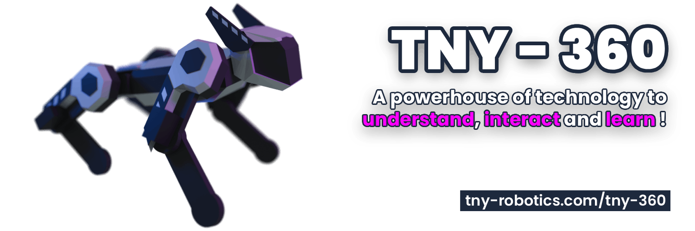

# TNY-360

**TNY-360** is a compact, open-source quadruped robot (robot dog) designed to **understand**, **interact** and **learn**!

It combines **3D-printable parts** and a PlatformIO-based firmware targeting an **ESP32-S3 N16R8** module using the **ESP-IDF framework**.

You can learn more about TNY-360 and find assembly instructions, wiring diagrams, and PCB files on the [TNY Robotics website](https://tny-robotics.com/tny-360).

## Highlights
- Lightweight quadruped platform for learning robotics, programming, and AI
- 3D CAD models (FreeCAD) included in the CAD folder for modification and printing
- Firmware is a PlatformIO project (VSCode) for ESP32-S3 (ESP-IDF)
- Uses TNY Robotics drivers for common sensors and PWM controllers:
    - MPU6050 driver: https://github.com/TNY-Robotics/mpu6050-esp-idf
    - PCA9685 driver: https://github.com/TNY-Robotics/pca9685-esp-idf
    - SH1106 driver: https://github.com/TNY-Robotics/sh1106-esp-idf
    - INA226 driver: https://github.com/TNY-Robotics/ina226-esp-idf

## Repository layout
- `CAD/` — FreeCAD project and all 3D models
- `Firmware/` — PlatformIO project to build and flash the ESP32-S3 firmware
- `LICENSE` — Project license (CC BY-NC-SA 4.0)

## Hardware
- Controller: ESP32-S3 N16R8 module
- MPU6050 6-axis IMU for orientation sensing
- PCA9685 16-channel PWM driver for motor control
- VL053L0X Time-of-Flight distance sensor for obstacle detection
- 12x MG996R servos for leg movement *(MODIFIED FOR POSITION FEEDBACK)*
- 2x SG-90 servos for ears movement
- SH1106 128x64 OLED display for face/menu display
- I2S microphone for sound input
- Speaker for sound output
- OV2640 camera module for vision
- INA219 current/power sensor for battery monitoring
- Power: 3S LiPo battery (6x Samsung INR18650-25R cells)
- 3D-printed chassis, head, ears and leg assemblies (see `CAD/`)

## Firmware (quick start)
Requirements:
- Visual Studio Code with the PlatformIO extension, or PlatformIO Core (CLI)
- USB cable to the ESP32-S3 module
- Correct serial/boot drivers installed for your OS

To build and upload from VSCode:
1. Open VSCode and install PlatformIO extension.
2. Open the `Firmware/` folder as a workspace.
3. Select the proper environment (ESP32-S3) in PlatformIO’s status bar.
4. Click "Build" to compile, and "Upload" to flash.

To build and upload from CLI:
- From the repository root:
    - Build: `pio run -d Firmware`
    - Upload: `pio run -d Firmware --target upload --environment <env-name>`
Replace `<env-name>` with the environment name defined in `Firmware/platformio.ini` (check that file for exact name).

Notes:
- PlatformIO will use the ESP-IDF framework configured in the project. If you prefer raw ESP-IDF tooling, follow ESP-IDF docs and the Firmware README for alternate instructions.
- Ensure the correct serial port is selected or provide it with `--upload-port /dev/ttyUSB0` (or COM port on Windows).

## Dependencies / Drivers
This project uses driver libraries maintained by TNY Robotics:
- MPU6050 (IMU): https://github.com/TNY-Robotics/mpu6050-esp-idf
- PCA9685 (PWM): https://github.com/TNY-Robotics/pca9685-esp-idf
- SH1106 (OLED): https://github.com/TNY-Robotics/sh1106-esp-idf
- INA226 (Current/Power): https://github.com/TNY-Robotics/ina226-esp-idf

Drivers are included as git submodules under `Firmware/components/`. If they are not present locally, initialize or add them:

- Initialize existing submodules:
    - `git submodule update --init --recursive`
- Or add a missing driver:
    - `git submodule add <repo-url> Firmware/components/<name>`

(You can also use PlatformIO's `lib_deps` / `lib_extra_dirs` in `platformio.ini` if you prefer.)

## Contributing
- Issues and pull requests are welcome.
- For code contributions, follow the repository style and test on real hardware when possible.
- If adding parts or firmware features, include clear build/upload instructions and any hardware changes.

## Troubleshooting
- If a build fails: confirm PlatformIO and toolchain are up to date.
- If uploading fails: check boot mode (ESP32-S3 often requires entering download mode), USB cable, and port permissions.

## License

This project is licensed under the **Creative Commons Attribution-NonCommercial-ShareAlike (CC BY-NC-SA 4.0) License**.

See the [LICENSE](./LICENSE) file, or the [Creative Commons](https://creativecommons.org/licenses/by-nc-sa/4.0/) website for details.

## Authors

This repository is maintained by the TNY Robotics team - https://tny-robotics.com.

If you have any questions or suggestions, feel free to open an issue or contact us at [contact@tny-robotics.com](mailto:contact@tny-robotics.com).
