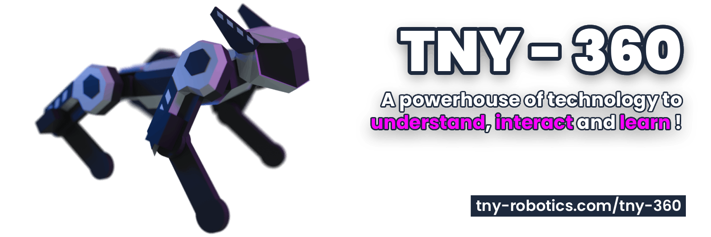

<div align="center">

# TNY-360 Quadruped Robot

[](https://creativecommons.org/licenses/by-nc-sa/4.0/)
[](https://espressif.com)
[](https://docs.espressif.com/projects/esp-idf/en/latest/esp32/)

**A compact, open-source robot dog designed to *Understand*, *Interact*, and *Learn*.**

[🌐 Website](https://tny-robotics.com/tny-360) • [📸 Instagram](https://instagram.com/furwaz_) • [💬 Discord](https://discord.gg/XGABkx5A4y)

</div>

---

## 🚀 Start Building

Everything you need to build the TNY-360 is completely free and open-source.
Follow the links below to find the technical files and documentation you need to get started!

| Resource | Description | Location | Status |
| :--- | :--- | :--- | :--- |
| **💻 Firmware** | ESP-IDF source code and drivers. | [`/Firmware`](./Firmware) | **Available** |
| **📐 CAD & 3D Files** | FreeCAD source files and STLs. | [`/CAD`](./CAD) | **Available** |
| **📘 Servo Mod Guide** | Instructions to add position feedback to MG996R. | [`/Docs/Servos`](./Docs/Servos) | *Coming Soon* |
| **📖 Assembly Guide** | Step-by-step manual for the full build. | [`/Docs/Assembly`](./Docs/Assembly) | *Coming Soon* |
| **⚡ PCB Design** | All PCBs Gerber, BOM, and Pick'n'Place files. | [`/Electronics/PCBs`](./Electronics/PCBs) | **Available** |
---

## ✨ Features

* **🦾 High-Performance Motion:** 12 DOF (Degrees of Freedom) using modified servos with position feedback.
* **🧠 AI-Ready Brain:** Powered by the **ESP32-S3 N16R8** for edge computing and Wi-Fi/BLE connectivity.
* **👀 Computer Vision:** Integrated camera (OV2640) for object tracking.
* **🗣️ Interaction:** Features an OLED face, microphone, and speaker for full HRI (Human-Robot Interaction).
* **🛠️ Fully Modifiable:** 100% 3D-printable chassis designed in **FreeCAD** (source files included).

## ⚙️ Hardware Specs

### 🧠 Core & Power
* **MCU:** ESP32-S3 N16R8 Module
* **Power:** 3S LiPo Battery (6x Samsung INR18650-25R)
* **Monitoring:** INA219 (Voltage/Current sensor)

### 🦵 Actuators
* **Legs:** 12x MG996R Servos *(Must be modified for analog feedback)*
* **Head:** 2x SG-90 Micro Servos (Ears)
* **Driver:** PCA9685 (16-Channel PWM)

### 📡 Sensors & I/O
* **Vision:** OV2640 Camera Module
* **Distance:** VL53L0X Time-of-Flight (Lidar)
* **Orientation:** MPU6050 6-axis IMU
* **Display:** SH1106 OLED (128x64)
* **Audio:** I2S MEMS Microphone + Speaker

---

## 💻 Firmware Quick Start

The firmware is built on **PlatformIO** using the **ESP-IDF** framework.

### Prerequisites
1.  **VS Code** installed.
2.  **PlatformIO** extension installed in VS Code.

### Installation
1.  **Clone** this repository:
    ```bash
    git clone --recursive https://github.com/TNY-Robotics/TNY-360.git
    ```
2.  **Open** the `Firmware/` folder in VS Code.
3.  **Connect** your ESP32-S3 via USB.
4.  **Upload:** Click the generic "Arrow" icon (➡️) in the PlatformIO bottom bar to Build & Flash.

> **Note:** If you are missing drivers, run `git submodule update --init --recursive` to pull the TNY-Robotics custom components.

---

## 📂 Repository Structure

* `CAD/` — **Hardware Source.** FreeCAD project files and ready-to-print STLs.
* `Firmware/` — **Codebase.** PlatformIO project (C++/ESP-IDF).
* `Firmware/components/` — **Drivers.** Custom libraries for sensors/actuators.

## 🤝 Contributing

We love contributions!
* **Code:** Please follow the ESP-IDF coding style.
* **Hardware:** Submit PRs with updated FreeCAD files or improvements.
* Found a bug? [Open an Issue](https://github.com/TNY-Robotics/TNY-360/issues).

## 📄 License & Authors

**TNY-360** is maintained by the [TNY Robotics Team](https://tny-robotics.com).

Licensed under **CC BY-NC-SA 4.0**.<br>
*You are free to share and adapt this material for non-commercial purposes, as long as you provide attribution and share alike.*

[](http://creativecommons.org/licenses/by-nc-sa/4.0/)

Need help? Contact us [by mail](mailto:contact@tny-robotics.com) or join our [Discord](https://discord.gg/XGABkx5A4y).